```{r setup, include=FALSE}
```

## Estrutura da apresentação


1. Lado real
  + Componentes da demanda
  + Mercado de trabalho
  + Guerra comercial

2. Lado monetário

# Componentes da demanda

## Crescimento Trim./Trim. ano anterior (em %)


## 

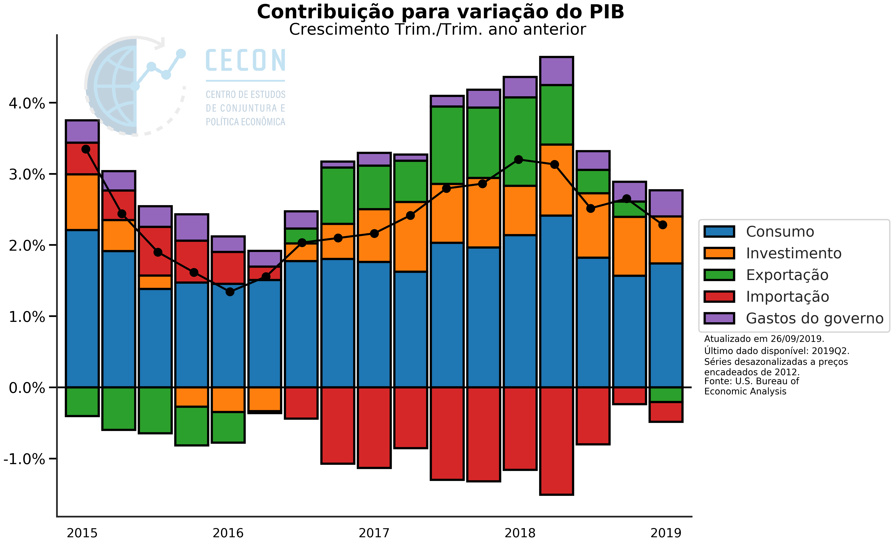

##

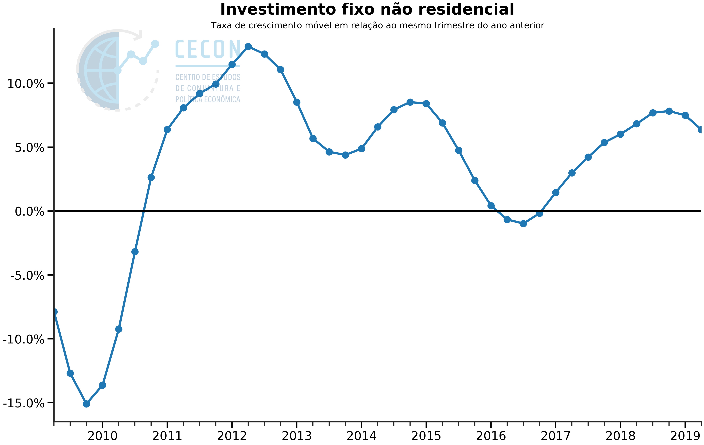

##

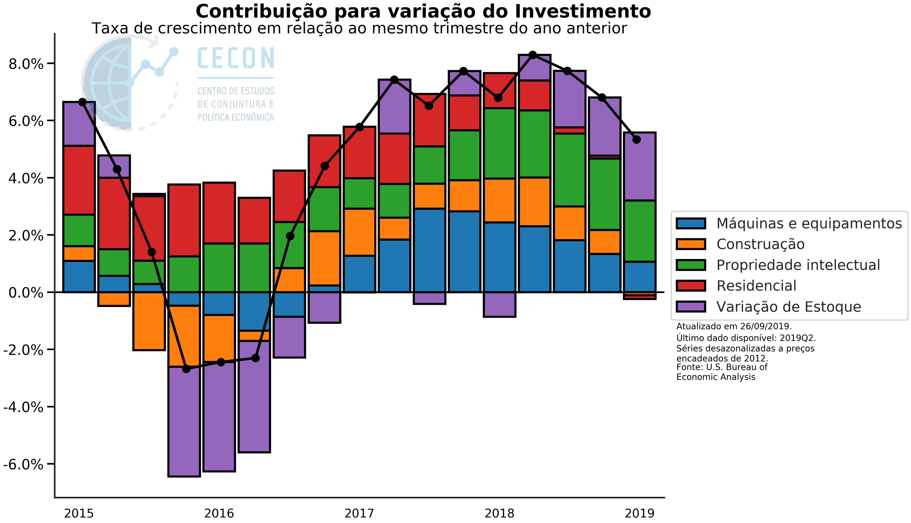

##

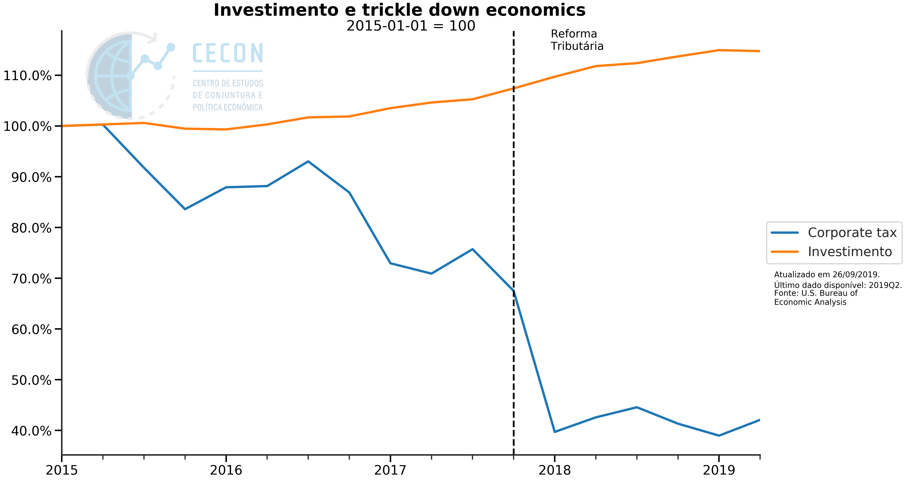


##

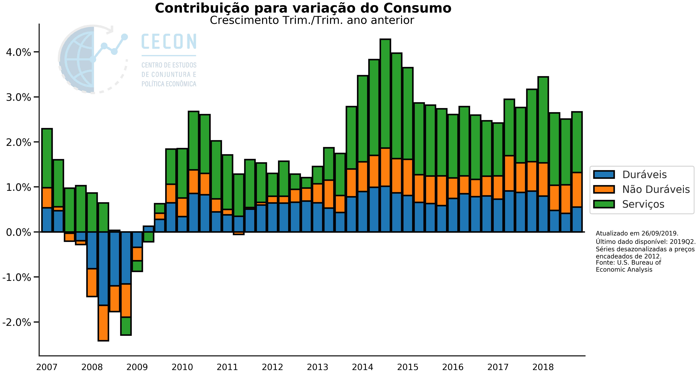

# Mercado de trabalho

##

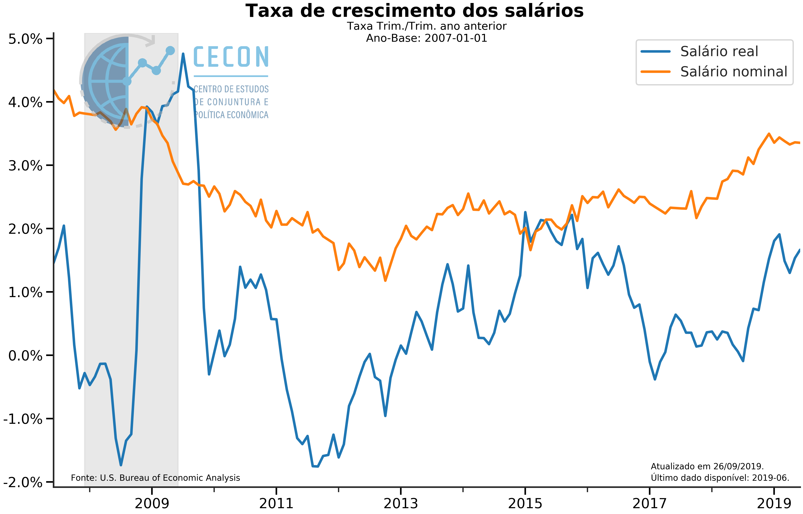


##


##

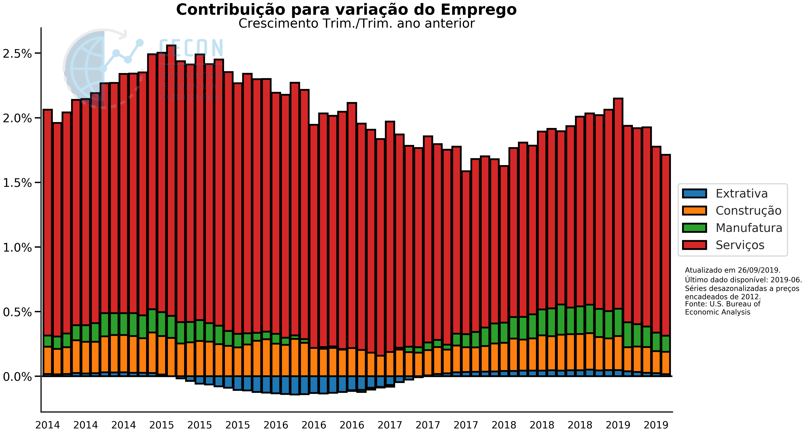

##

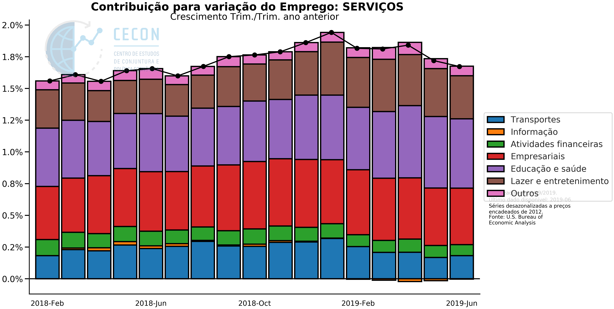

# Guerra comercial

##


## 

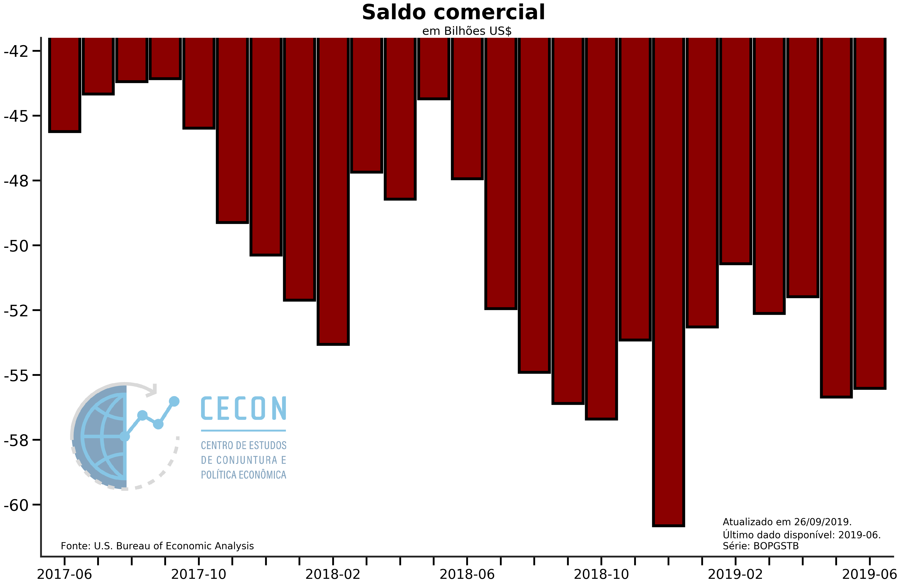

##


##


# Lado Monetário


##

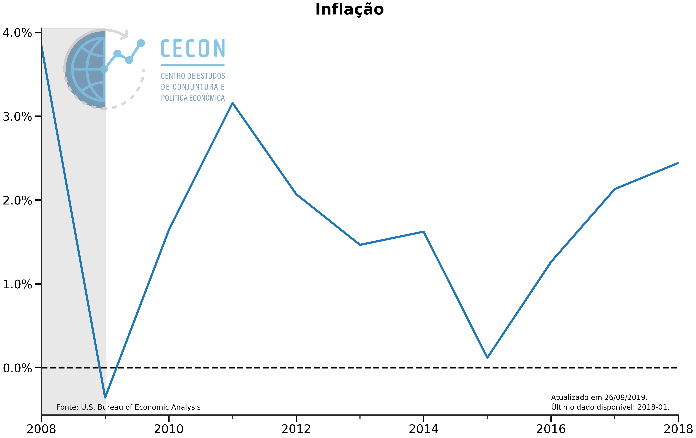

##


##

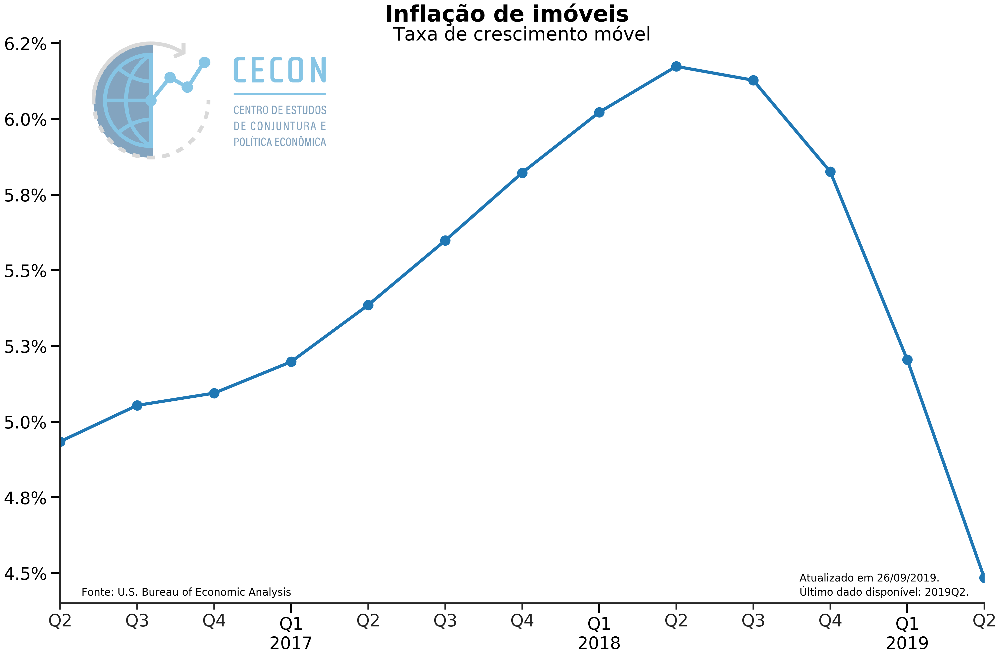

## 

